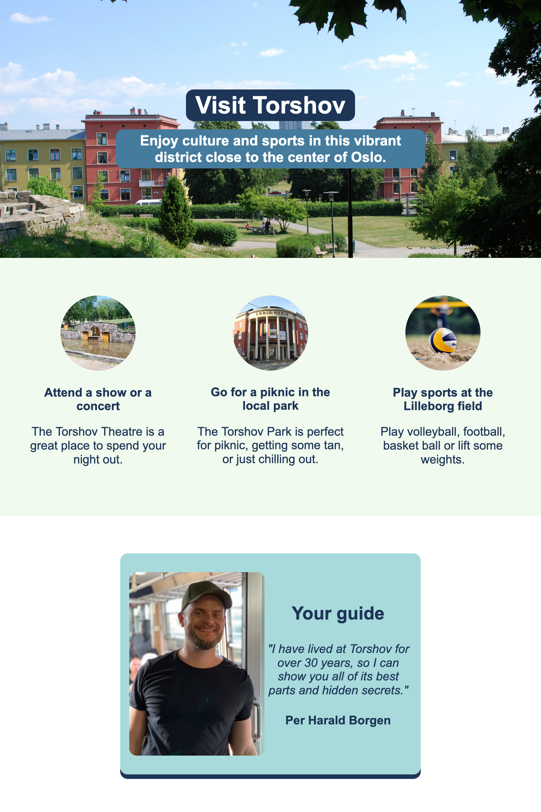

# Hometown Homepage

This is the first real project in the Scrimba Frontend Developer Career Path.

## Table of contents

-   [Overview](#overview)
    -   [The challenge](#the-challenge)
    -   [Screenshot](#screenshot)
    -   [Links](#links)
-   [My process](#my-process)
    -   [Built with](#built-with)
    -   [What I learned](#what-i-learned)
    -   [Continued development](#continued-development)
    -   [Useful resources](#useful-resources)
-   [Author](#author)

## Overview

### The challenge

The challenge was to recreate a Figma design of a simple tourism web page.

### Screenshot

### Links

-   Solution URL: <https://github.com/gdsimoes/scrimba-oslo/>
-   Live Site URL: <https://gdsimoes.github.io/scrimba-oslo/>

## My process

### Built with

-   Figma
-   Semantic HTML5 markup
-   CSS custom properties
-   Flexbox

### What I learned

The primary purpose of doing this project was to learn how to use Figma and recreate [this design](https://www.figma.com/file/2QuGfAOcHaZJ6aHXfuamnK/Hometown-Homepage?node-id=0%3A1). Figma was surprisingly easy to use, and the generated CSS was an excellent guide, especially for things like `box-shadow`, `border-radius` and `line-height`. I didn't make this website responsive because I tried to focus on recreating a static design as best as I could as a first exercise.

### Continued development

I am excited to continue using Figma on both Scrimba and Frontend Mentor projects in the future. It's much easier than looking at an image design and just guessing property values.

### Useful resources

-   [Intro to Figma for Developers](https://www.youtube.com/watch?v=ybc2gkvjMDs) - This is a bare-bones introduction to Figma made by Scrimba. It was short and sweet and had everything I needed for this project.
-   [Figma for Developers](https://frontendmasters.com/courses/figma/) - This is a long and thorough course from Frontend Masters. I didn't finish watching the whole thing, but I learned quite a lot, and I plan on finishing this course soon.

## Author

-   Website - <https://gdsimoes.com>
-   LinkedIn - [Guilherme Dias Simoes](https://www.linkedin.com/in/gdsimoes)
